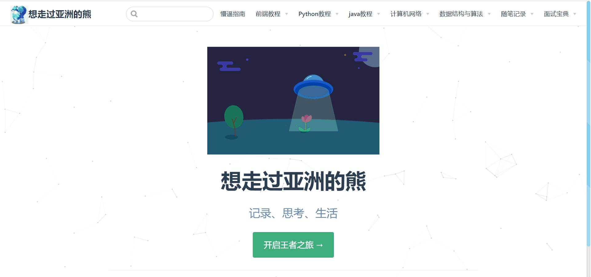

# 不定时更新笔记,思考,算法!

本套资料是作者随笔学习记录,持续更新!

**资料包含**

- 前端
- 后端
- 计算机网络
- 操作系统
- 数据结构与算法
- ...

**笔者仓库地址**  
:earth_asia:github 地址 : **https://github.com/xp-bear**  
:earth_asia:gitee 地址 : **https://gitee.com/xp-bear**

**笔记地址** :airplane: :   http://blog.xxoutman.cn

